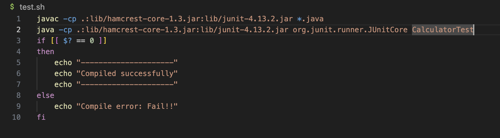
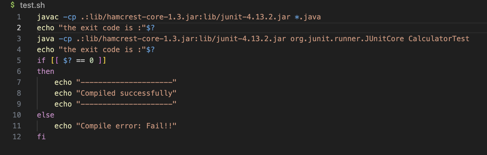
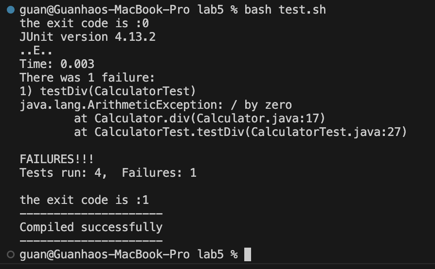
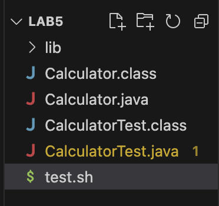
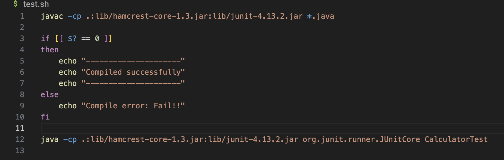
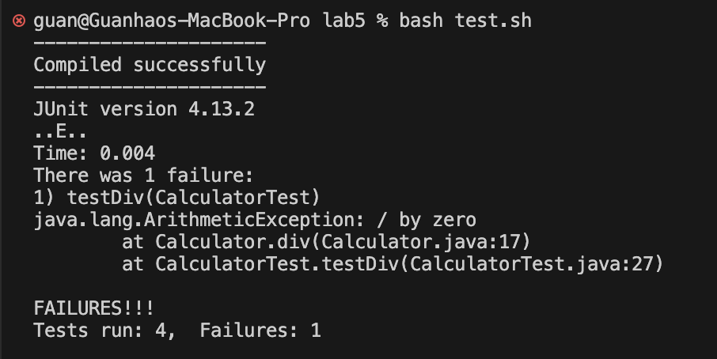

<h1>Part 1 – Debugging Scenario</h1>
<h2>Student Post:</h2>
Hi, TAs and tutors, I think I need some help on debugging my calculator testing java code. I am writing a java code that can do addition, subtraction, multiplication, and division when user provides number a and number b. The result of my java file seems good but the output of the test.sh is not the same as my expectation.
<br/>
<b>Here are my java codes:</b>
<br/>
<b>Calculator.java:</b>
<br/>

<br/>
<b>CalculatorTest.java:</b>
<br/>

<br/>
<b>Here is my bash script:</b>
<br/>

<br/>
<b>Here is my terminal result with bug:</b>
<br/>

<br/>
<b>The command line I use to run the bash script is:</b>
`bash test.sh`
<br/>
<b>My guess to the symptom:</b>
<br/>
As my output of the java test file is the same as my expectation, it means that the file should be compiled successfully. I would say that the bug would be on my bash script file. Might there be a problem with my `if statement` in the bash script?
<h2>Ta response:</h2>
Hi! I see your provided code and command, I believe that your guess is really close. I suggest that you try to add the command line `echo "the exit code is :"$?` before your if statement and after the 'javac' command to check if your `if statement` receive the correct exit code.
<h2>Student Response:</h2>
Thank you so much for the help! Here is the result with your recommended change:
<br/>
<b>New bash script:</b>
<br/>

<br/>
<b>New result:</b>
<br/>

<br/>
<b>Description of the bug:</b>
<br/>
After `javac` compiling, I didn't put the `if statement` to check for compile status. Instead I do `java` to run my test. After running my test, I use if statement to check for compile status. But the exit code that the `if statement` received was from `java` command which is `1` as shown. Therefore the if statement didn't print what we expected.
<h2>At the end, all the information needed about the setup</h2>
<b>The file & directory structure needed:</b>
<br/>

<br/>
<b>The contents of each file before fixing the bug</b>
<br/>
<p>Calculator.java:</p>

```java
public class Calculator {
    static int add(int a, int b){
        int answer = a + b;
        return answer;
    }
    static int sub(int a, int b){
        int answer = a - b;
        return answer;
    }
    static int mult(int a, int b){
        int answer = a * b;
        return answer;
    }
    static int div(int a, int b){
        int answer = a / b;
        return answer;
    }

}
```

<p>CalculatorTest.java:</p>

```java
import static org.junit.Assert.*;
import org.junit.*;

public class CalculatorTest {
@Test
public void testAdd(){
    int a = 5;
    int b = 0;
    Calculator.add(a, b);
}
@Test
public void testSub(){
    int a = 5;
    int b = 0;
    Calculator.sub(a, b);
}
@Test
public void testMult(){
    int a = 5;
    int b = 0;
    Calculator.mult(a, b);
}
@Test
public void testDiv(){
    int a = 5;
    int b = 0;
    Calculator.div(a, b);
}
}
```
<p>test.sh:</p>

```java
javac -cp .:lib/hamcrest-core-1.3.jar:lib/junit-4.13.2.jar *.java

java -cp .:lib/hamcrest-core-1.3.jar:lib/junit-4.13.2.jar org.junit.runner.JUnitCore CalculatorTest

if [[ $? == 0 ]]
then
    echo "---------------------"
    echo "Compiled successfully"
    echo "---------------------"
else
    echo "Compile error: Fail!!"
fi
```
<br/>
<b>The full command line (or lines) you ran to trigger the bug:</b>
<br/>
`bash test.sh`
<br/>
<b>A description of what to edit to fix the bug:</b>
<br/>
<p>After determine where the bug is. I can make changes to fix the bug. The first thing is find where should the if statement goes, which should be next to the `javac` command. Next step is to cut the whole `if statement` and paste next to the `javac` command.</p>
<p>After fixing the bash script file, it should look like this:</p>

<p>After fixing the bash script file, we can run the command `bash test.sh` to check if the bug is fixed. The result below shows that the bug is fixed!</p>

<h1>Part 2 - Reflection</h1>
<p>Some cool things that I learned from the second half quarter would be the tool `jdb`. This is really new to me, I didn't know there was a useful tool like this before. After learning how to use `jdb`, I feel that the process of debugging is faster. The coolest thing about `jdb` is that it can help me go through my code line by line to check for bugs. It can also print out the value of the local variables for me. That would be really helpful!</p>
