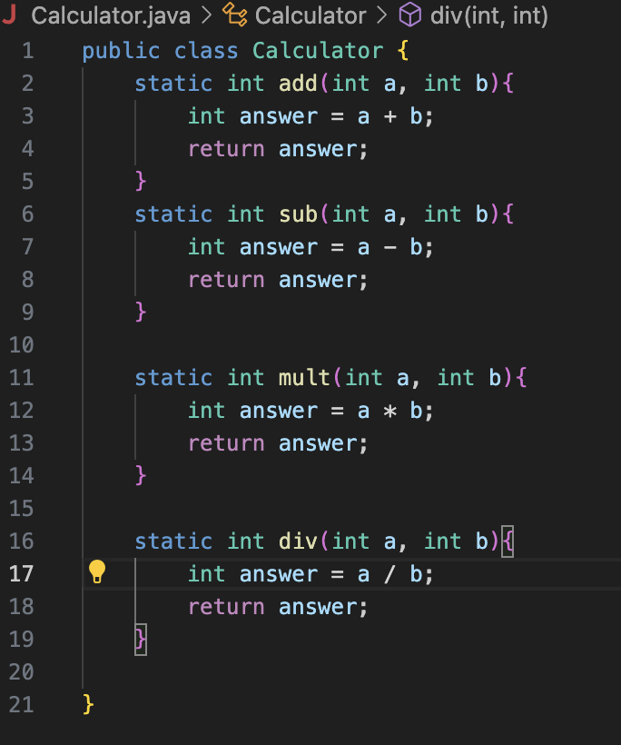
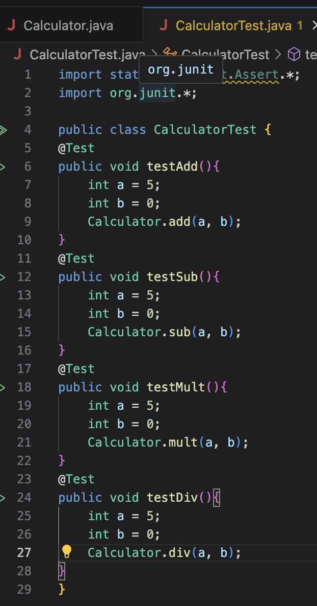
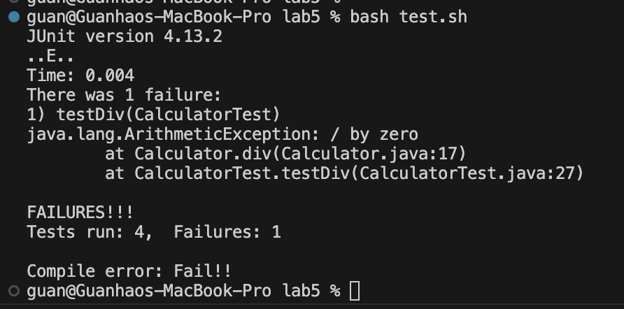

<h1>Part 1 – Debugging Scenario</h1>
<h2>Student Post:</h2>
Hi, TAs and tutors, I think I need some help on debugging my calculator testing java code. I am writing a java code that can do addition, subtraction, multiplication, and division when user provides number a and number b. The result of my java file seems good but the output of the test.sh is not the same as my expectation.
Here are my java codes:
Calculator.java:

CalculatorTest.java:

Here is my bash script:

Here is my terminal result with bug:

The command line I use to run the bash script is:
`bash test.sh'
